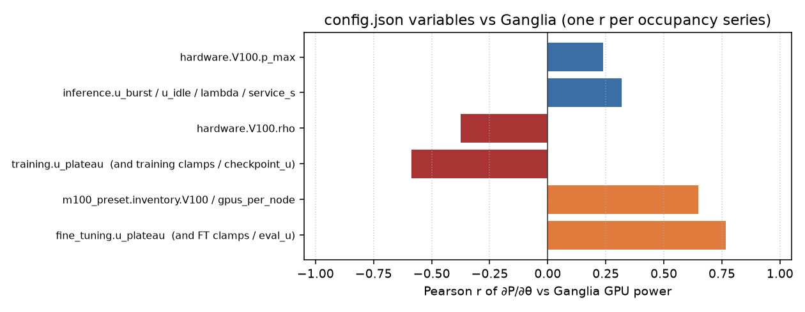

# Correlation of config.json variables with Ganglia GPU power

Yes: this is **each `config.json` knob vs measured Ganglia GPU power** on 2022-03-20. Config values are constants, so the r below is

\[ r\big(\partial P/\partial \theta,\; P_{\mathrm{ganglia}}\big) \]

Knobs that scale the same GPU-count series share the same r. **Partial r** holds the other stages fixed — use that to decide independence.

## Summary (one r per occupancy family)

| config.json family | Pearson r | Partial r | Independent driver? |
|---|---:|---:|---|
| `stage_physics.fine_tuning.u_plateau` (also FT `u_min`/`u_max`, `eval_*`) | **+0.766** | **+0.777** | **Yes — search first** |
| `m100_preset.inventory.V100` / `gpus_per_node` | +0.649 | +0.200 | Occupancy cap, not a util knob |
| `stage_physics.inference.u_burst`, `u_idle`, `default_lambda`, `service_s` | +0.318 | **+0.474** | **Yes — search first (level)** |
| `hardware.V100.p_max` | +0.239 | — | Freeze (physical TDP 300 W) |
| `hardware.V100.rho` | -0.375 | -0.057 | No (almost no idle GPUs this day) |
| `stage_physics.training.u_plateau` (also training clamps / `checkpoint_*`) | -0.588 | -0.079 | **No — confounder of stage mix** |
| `stage_physics.*.sigma_*`, `wave_*`, `u_default`, `validate.baseline_kw` | — | — | Unused, noise, or not Ganglia |

## Full config.json list

| config.json variable | Pearson r vs Ganglia | Partial r | Used? | Multiplies |
|---|---:|---:|:---:|---|
| `stage_defaults.fine_tuning.u_max` | +0.766 | +0.777 | yes | `n_req_fine_tuning` |
| `stage_defaults.fine_tuning.u_min` | +0.766 | +0.777 | yes | `n_req_fine_tuning` |
| `stage_physics.fine_tuning.eval_dur_ms` | +0.766 | +0.777 | yes | `n_req_fine_tuning` |
| `stage_physics.fine_tuning.eval_period_ms` | +0.766 | +0.777 | yes | `n_req_fine_tuning` |
| `stage_physics.fine_tuning.eval_u` | +0.766 | +0.777 | yes | `n_req_fine_tuning` |
| `stage_physics.fine_tuning.eval_u_max` | +0.766 | +0.777 | yes | `n_req_fine_tuning` |
| `stage_physics.fine_tuning.eval_u_min` | +0.766 | +0.777 | yes | `n_req_fine_tuning` |
| `stage_physics.fine_tuning.u_plateau` | +0.766 | +0.777 | yes | `n_req_fine_tuning` |
| `m100_preset.gpus_per_node` | +0.649 | +0.200 | yes | `alloc_gpus` |
| `m100_preset.inventory.V100` | +0.649 | +0.200 | yes | `alloc_gpus` |
| `stage_defaults.training.u_max` | -0.588 | -0.079 | yes | `n_req_training` |
| `stage_defaults.training.u_min` | -0.588 | -0.079 | yes | `n_req_training` |
| `stage_physics.training.checkpoint_dur_ms` | -0.588 | -0.079 | yes | `n_req_training` |
| `stage_physics.training.checkpoint_ms` | -0.588 | -0.079 | yes | `n_req_training` |
| `stage_physics.training.checkpoint_u` | -0.588 | -0.079 | yes | `n_req_training` |
| `stage_physics.training.checkpoint_u_max` | -0.588 | -0.079 | yes | `n_req_training` |
| `stage_physics.training.checkpoint_u_min` | -0.588 | -0.079 | yes | `n_req_training` |
| `stage_physics.training.u_plateau` | -0.588 | -0.079 | yes | `n_req_training` |
| `hardware.V100.rho` | -0.375 | -0.057 | yes | `n_eff_idle` |
| `stage_defaults.inference.u_max` | +0.318 | +0.474 | yes | `n_req_inference` |
| `stage_defaults.inference.u_min` | +0.318 | +0.474 | yes | `n_req_inference` |
| `stage_physics.inference.default_lambda` | +0.318 | +0.474 | yes | `n_req_inference` |
| `stage_physics.inference.idle_u_max` | +0.318 | +0.474 | yes | `n_req_inference` |
| `stage_physics.inference.service_s` | +0.318 | +0.474 | yes | `n_req_inference` |
| `stage_physics.inference.u_burst` | +0.318 | +0.474 | yes | `n_req_inference` |
| `stage_physics.inference.u_idle` | +0.318 | +0.474 | yes | `n_req_inference` |
| `hardware.V100.p_max` | +0.239 | — | yes | `modeled_fleet_kw` |
| `replay.stage_thresholds.finetuning_min_duration_h` | — | — | yes | `—` |
| `replay.stage_thresholds.inference_max_nodes` | — | — | yes | `—` |
| `replay.stage_thresholds.training_min_duration_h` | — | — | yes | `—` |
| `replay.stage_thresholds.training_min_nodes` | — | — | yes | `—` |
| `stage_defaults.fine_tuning.u_default` | — | — | no | `—` |
| `stage_defaults.inference.u_default` | — | — | no | `—` |
| `stage_defaults.training.u_default` | — | — | no | `—` |
| `stage_physics.fine_tuning.eval_sigma` | — | — | yes | `—` |
| `stage_physics.fine_tuning.sigma_plateau` | — | — | yes | `—` |
| `stage_physics.fine_tuning.wave_amp` | — | — | no | `—` |
| `stage_physics.fine_tuning.wave_period_ms` | — | — | no | `—` |
| `stage_physics.inference.sigma_burst` | — | — | yes | `—` |
| `stage_physics.inference.sigma_idle` | — | — | yes | `—` |
| `stage_physics.training.checkpoint_sigma` | — | — | yes | `—` |
| `stage_physics.training.sigma_plateau` | — | — | yes | `—` |
| `stage_physics.training.wave_amp` | — | — | no | `—` |
| `stage_physics.training.wave_period_ms` | — | — | no | `—` |
| `validate.baseline_kw` | — | — | yes | `—` |

## How to read this

- **|r| near 0.77:** fine-tuning occupancy. `fine_tuning.u_plateau` (and its clamps/eval util) is the config variable whose effect matches Ganglia.
- **|r| near 0.32 (partial ~0.47):** inference occupancy. `u_burst`, `u_idle`, `default_lambda`, `service_s`.
- **|r| near −0.59 but partial ≈ 0:** training occupancy. Looks correlated, is a confounder of stage mix.
- **rho |r| ≈ −0.38, partial ≈ 0:** idle GPUs are almost never present this day.
- **Unused / noise / Tot_ict baseline:** no Ganglia correlation to estimate.

CSV: `rl_tune/results/config_variables_vs_ganglia.csv`.
