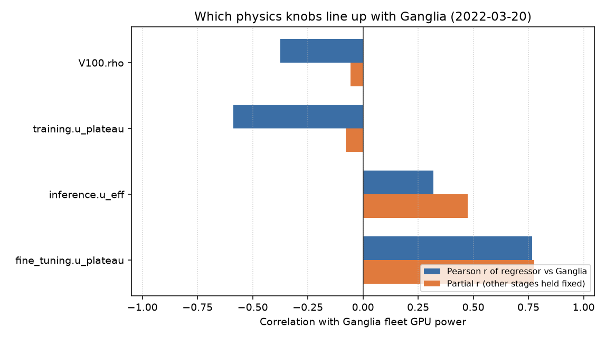
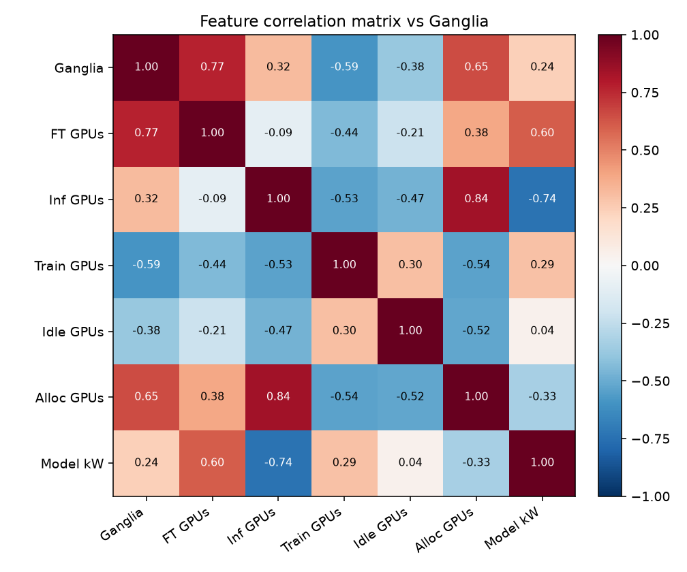
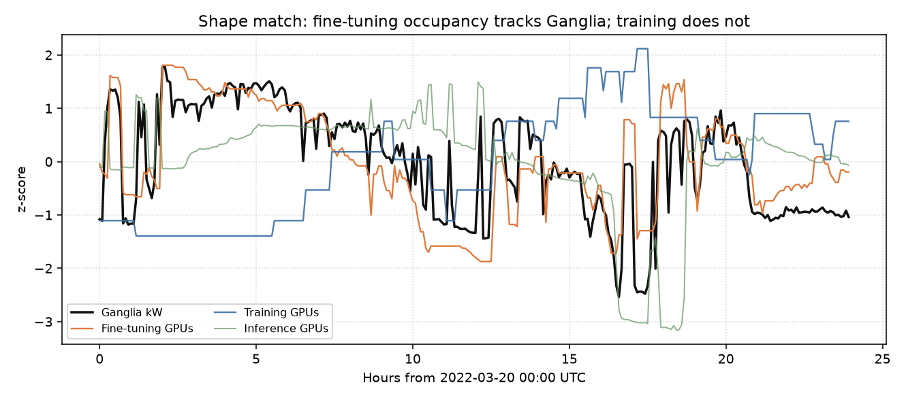
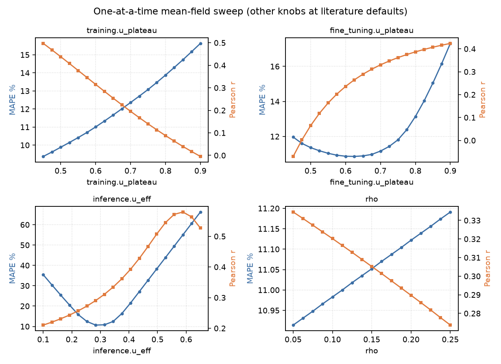
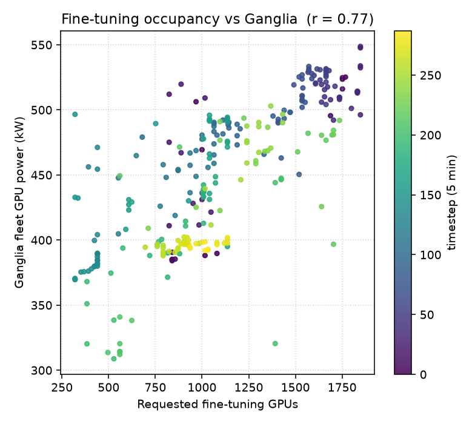

## Data

Intended bundle (professor Drive folder):

https://drive.google.com/drive/folders/1M0t-VCc8n8SLASO934fr3h5tW7_aw46J

This environment cannot read that folder until it is shared as **Anyone with the link (Viewer)** (`gdown` currently gets HTTP 401). After that:

```bash
pip install -r rl_tune/requirements.txt
python -m rl_tune.fetch_drive_data
export EXADATA_ROOT=/workspace/data
python -m rl_tune.correlate_params
```

The numbers below still come from the cached 2022-03-20 ganglia day slice in the repo (`validation_v2/slice_cache/day_slice.json`), not from the Drive bundle.

---

Window: **22-03** `2022-03-20T00:00:00Z` → `2022-03-21T00:00:00Z` (288 points at 5 min).

Measured source: `ganglia_pub Gpu*_power_usage sum` · mean 449.68 kW · current model r = **0.2388**.

Requested GPUs exceed inventory on **97%** of bins (mean request 5502.8 vs 3780 V100s). On this slice, occupancy is saturated; stage *mix* drives Ganglia variation.

## Ranked physics knobs

| Parameter | Pearson r (requested GPUs) | Partial r | MAPE span (1-D sweep) | RL priority |
|---|---:|---:|---:|---:|
| `fine_tuning.u_plateau` | 0.766 | 0.7768 | 6.454 | 1.0995 |
| `inference.u_eff` | 0.3182 | 0.4736 | 55.566 | 1.4736 |
| `training.u_plateau` | -0.5877 | -0.0785 | 6.258 | 0.3914 |
| `rho` | -0.3754 | -0.0566 | 0.277 | 0.0704 |

**Partial r** is the correlation of that parameter’s GPU-count regressor with Ganglia after linearly removing the other stages. That is the number to trust for “does this knob independently track measured power?”

### Search first

- `fine_tuning.u_plateau`
- `inference.u_eff`

### Search next (level / mix)

- *(none on this slice)*

### Confounders (raw r only — do not search yet)

- `training.u_plateau`

### Defer on this slice

- `rho`

### Classification thresholds (high leverage, not a util knob)

- `replay.stage_thresholds.training_min_duration_h`
- `replay.stage_thresholds.training_min_nodes`
- `replay.stage_thresholds.finetuning_min_duration_h`
- `replay.stage_thresholds.inference_max_nodes`

## Notes

- Fleet is oversubscribed on this slice, so idle GPUs are rare and V100.rho barely changes MAPE. Re-check rho on a window with idle capacity.
- training.u_plateau has a strong raw anti-correlation with Ganglia that collapses after controlling for fine-tuning/inference counts — it is a confounder of stage mix, not an independent driver. Stage-classification thresholds that move jobs between training and fine-tuning are high leverage.

## OLS implied util (mean-field, no intercept)

Fit `P_ganglia ≈ Σ β_s n_eff,s` then `u = β / (P_max/1000)`. R² = 0.6506, r = 0.8066.

| Term | kW / GPU | Implied util |
|---|---:|---:|
| training | -0.03678 | -0.1226 |
| fine-tuning | 0.21018 | 0.7006 |
| inference | 0.11213 | 0.3738 |
| idle (rho) | 0.06143 | 0.2048 |

Training’s implied util is negative because its GPU count is a confounder (raw r vs Ganglia is negative; partial r ≈ 0). Fine-tuning implied util (~0.70) sits next to the literature plateau 0.68.

## Plots











## How to rerun

```bash
python -m rl_tune.correlate_params
```

Raw numbers: `rl_tune/results/ganglia_param_correlation.json`.
