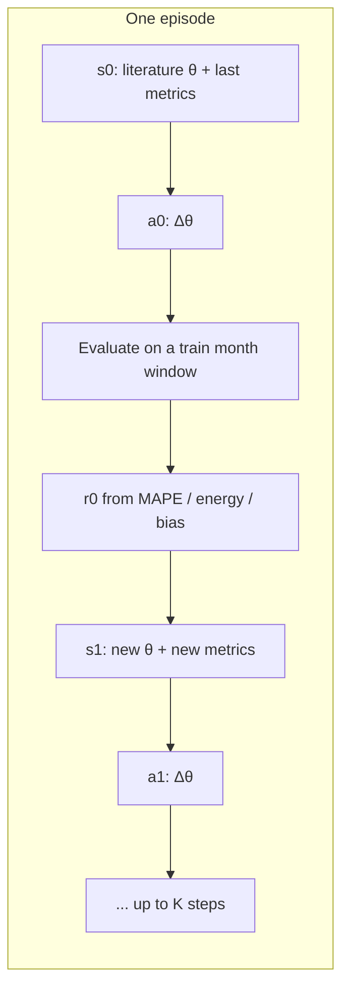

# Plan: Reinforcement learning to tune the IT power model against Ganglia

This plan is for using **reinforcement learning (RL)** to search `config.json` so the `server.py` fleet-power formula matches **measured GPU power from `ganglia_pub`** as closely as possible, assuming Ganglia exists for every month in the ExaData bundle.

It is a search plan, not an implementation. The current validation stack already has the pieces this would reuse: Ganglia aggregation (`validation/exadata.py`), job replay (`server.job_to_task`), the physics formula (`server.compute_macro_at` / `validation/core.py`), and metrics (MAPE, energy error, bias).

---

## 1. Goal

Find one **global parameter vector** \(\theta\) such that, for every month with `job_table` + `ganglia_pub`:

\[
P_{\text{model}}(t;\theta) \approx P_{\text{ganglia}}(t)
\]

where \(P_{\text{ganglia}}\) is fleet GPU power (kW) from \(\sum\) `Gpu{0–3}_power_usage`, and \(P_{\text{model}}\) is the existing formula:

\[
P(t)=\sum_k N_k P_{k,\max}\bigl[\eta_k(t)\sum_m(u_m\alpha_m(t))+(1-\eta_k(t))\rho_k\bigr]
\]

**Success (held-out months, not the day used to tune):**

| Metric | Current published target | Stretch (“close to perfect”) |
|---|---|---|
| Power MAPE | &lt; 15% | &lt; 5% |
| Energy error | &lt; 10% | &lt; 3% |
| Mean bias | — | \(\lvert\text{bias}\rvert &lt; 5\%\) of mean measured kW |
| Correlation \(r\) | — | \(r &gt; 0.95\) |

The agent must beat **literature defaults in `config.json`** on held-out months. A one-day overlay (e.g. 2022-03-20 in validation v2) is not enough.

---

## 2. Use Ganglia, not `Tot_ict`

`logics_pub Tot_ict` is **facility IT total** (GPUs + CPUs + memory + network). The formula currently models **V100 GPU fleet power**. That mismatch is why validation v3 adds a ~255 kW baseline.

Ganglia is the right target for “best model”:

- Same quantity the formula predicts (GPU watts → kW).
- No `baseline_kw` term; freeze baseline at **0**.
- Validation v2 already does this for a 1-day slice.

`Tot_ict` remains a later, separate problem (CPU/base-power term), not the RL objective.

---

## 3. What \(\theta\) actually is

Almost all knobs already live in `config.json`. Do **not** retune the formula structure. Search a **small, identifiable** subset.

### 3.1 Must search (high leverage on Ganglia)

Empirical ranking on the 2022-03-20 Ganglia day slice is in
`docs/ganglia_parameter_correlation.md` (rerun: `python -m rl_tune.correlate_params`).

| Parameter | Why it matters |
|---|---|
| `stage_physics.fine_tuning.u_plateau` | Strongest independent correlate of Ganglia (requested-FT GPUs: Pearson r ≈ 0.77, partial r ≈ 0.78). |
| `stage_physics.inference.u_burst` / `u_idle` / `default_lambda` | Inference GPU count has partial r ≈ 0.47 vs Ganglia; the util mix has the largest 1-D MAPE span. |
| `replay.stage_thresholds.*` | Training vs fine-tuning mix is the shape signal; thresholds that reclassify jobs are high leverage. |
| `stage_physics.training.u_plateau` | Large *raw* anti-correlation that mostly vanishes as a partial r — a confounder until classification is trusted. |
| `hardware.V100.rho` | Idle floor. **V100 currently has no `rho` in config** (fallback 0.117). Nearly inert on this oversubscribed day; re-check on idle windows. |
| `stage_defaults.{training,fine_tuning,inference}.{u_min,u_max}` | Hard clamps on sampled util. |

### 3.2 Optional (stage assignment)

`replay.stage_thresholds` are in the search set above. Do not expand them until
util plateaus are identified on a fixed classification; they interact strongly
with plateaus.

### 3.3 Freeze

| Parameter | Reason |
|---|---|
| `hardware.V100.p_max` | Physical TDP (300 W). Do not “fit” TDP. |
| `m100_preset.inventory` / `gpus_per_node` | Cluster facts (3780 GPUs, 4/node). |
| `sigma_*`, `wave_*` | Noise/waves average out on a 5-minute Ganglia grid. |
| `checkpoint_ms`, `checkpoint_dur_ms`, `eval_*` timing | 22 s dips are invisible after 5-minute median resampling. |
| `validate.baseline_kw` | Ganglia is GPU-only. |

Keep literature values as the **start state** and as an L2 regularizer so the agent cannot wander into physically absurd util (e.g. training plateau 0.15).

Suggested bounds (clip actions here):

```
V100.rho                         [0.05, 0.25]
training.u_plateau               [0.45, 0.90]
fine_tuning.u_plateau            [0.50, 0.90]
inference.u_burst                [0.40, 0.90]
inference.u_idle                 [0.02, 0.20]
inference.default_lambda         [20, 200]
stage u_min / u_max              keep u_min < plateau < u_max, all in (0, 1)
```

Start with **~6 continuous dimensions** (rho + 3 plateaus/burst/idle + lambda). Add clamps and stage thresholds only if validation error is still structured (e.g. systematic mis-labeling of job types).

---

## 4. MDP (how to make this actually RL)

This is black-box parameter search. A one-shot “emit \(\theta\), get MAPE” problem is a **bandit**, not a sequential control task. Frame it as an **iterative tuner** so PPO/SAC have a real horizon.



**State \(s_t\)** (normalized):

- Current \(\theta\) in \([0,1]^d\)
- Last metrics: MAPE, energy error, bias / mean(kW), Pearson \(r\)
- Residual shape: p10 / p50 / p90 of \((P_{\text{model}}-P_{\text{ganglia}})\)
- Step index \(t/K\)
- Optional context: mean allocated GPUs, stage mix, month id (so the policy can condition on load)

**Action \(a_t\)**:

- Continuous \(\Delta\theta\) in \([-1,1]^d\), scaled by a per-parameter step size (e.g. 5–15% of the bound width).
- Clip \(\theta\) to bounds after each step.
- Enforce `u_min ≤ u_plateau ≤ u_max` by projection.

**Episode:** \(K = 8\)–\(16\) steps, starting from literature defaults (or a random feasible \(\theta\) for exploration). Each step evaluates **one sampled train window** (a day or a week), not the full month, so the policy sees many workload contexts.

**Reward** (dense, same units as published metrics):

\[
r_t = -\alpha\,\text{MAPE}_t - \beta\,\text{Eerr}_t - \gamma\,\lvert b_t\rvert/\bar{P}
      + B_{\text{mape}}\mathbf{1}[\text{MAPE}&lt;5]
      + B_{\text{e}}\mathbf{1}[\text{Eerr}&lt;3]
      - \lambda\lVert\theta-\theta_{\text{lit}}\rVert^2
\]

Suggested weights: \(\alpha=1\), \(\beta=0.5\), \(\gamma=10\), \(B_{\text{mape}}=10\), \(B_e=5\), small \(\lambda\).

Terminal bonus: extra reward if the **same** \(\theta\) is re-evaluated on a second held-in month and still beats the MAPE target (reduces one-day overfitting).

---

## 5. Data: all months, but never train on raw Ganglia rows

Raw `ganglia_pub` is ~20 s × ~980 nodes. RL will call the simulator thousands of times. **Pre-aggregate once**, then train on caches.

For each `year_month=*`:

1. `load_ganglia_gpu_power` already floors to 1 minute, means per (minute, node, GpuN), then sums to fleet kW. Reuse it.
2. Resample to the validation grid (**300 s median**, same as `validate.grid_seconds`).
3. Load overlapping `job_table` rows → `jobs_to_records`.
4. Write:

```
rl_tune/cache/year_month=YY-MM/
  ganglia_5min.parquet    # timestamp, kw
  jobs.parquet            # start_time, end_time, num_nodes, num_gpus, job_id
  meta.json               # n_nodes, n_rows, mean/peak kW
```

Caches stay local (`*.parquet` is already gitignored).

**Splits (adjust to whatever months are on disk):**

| Split | Role |
|---|---|
| Train months | Episode evaluations (sample random 1-day or 7-day windows) |
| Val month | Early-stop / pick checkpoint; never used for SGD-style updates of \(\theta\) inside an episode |
| Test months | Final report only |

Example if 22-03 … 22-09 are present: train 03–05, val 06, test 07–09.

**Window sampling:** uniform random start on a 1-day window inside the month, jobs that overlap that window. This matches how the UI is used and keeps each env step cheap.

---

## 6. Fast, deterministic evaluation

Each env step must be seconds, not minutes.

1. **Patch `server` in memory** — copy `HW` / `S_PHY` / `S_DEF` / `replay.stage_thresholds`, apply \(\theta\), restore after the step. Do not rewrite `config.json` until export.
2. **Reuse `validation.core.simulate_on_grid`** with `draws=1` and **all `sigma_*=0` during training** so util is the plateau/burst/idle mean. Stochastic dips are not identifiable at 5 min and make the reward noisy.
3. **Skip Poisson inference schedules during search** (use the occupancy approximation already in `stochastic_util` when `schedule is None`). Rebuild full schedules only for the final overlay.
4. **Cap grid points** (e.g. 288 points/day at 5 min). Do not use `max_grid_points=120` from the UI; that is a display downsample and would bias energy integrals.
5. **Optional later:** vectorize `_fleet_kw_at` if Python is still the bottleneck.

A 1-day step should be fast enough for PPO (~10⁴ steps). If not, drop to hourly bins for the inner loop and re-score winners at 5 min.

---

## 7. Algorithm and honest baselines

**Primary (what the professor asked for):** PPO with a continuous action space (Stable-Baselines3 + Gymnasium). SAC is the fallback if PPO is too noisy on this dense reward.

**Why PPO:** standard, well-documented, continuous \(\Delta\theta\), easy to report (learning curve of MAPE vs env steps).

**Must-run baselines with the same evaluation budget** (same number of `simulate_on_grid` calls):

1. Literature \(\theta\) (current `config.json`)
2. Random search in the same bounds
3. Bayesian optimization (Optuna TPE or CMA-ES)

If BO wins on sample efficiency, still ship the RL result — but the write-up should say so. Parameter fitting is not a natural MDP; RL is justified as “learn a sequential tuning policy from defaults,” not as the uniquely correct optimizer.

Do **not** train a neural net to replace `server.py`. The deliverable is a **better `config.json`**, plus the search code.

---

## 8. Proposed layout (when implementing)

```
rl_tune/
  README.md              # how to cache, train, export
  space.py               # bounds, encode/decode, projection
  apply_params.py        # patch/restore server.HW, S_PHY, S_DEF
  evaluate.py            # simulate_on_grid + compute_metrics on a window
  reward.py              # r_t from metrics + literature prior
  env.py                 # gymnasium.Env
  prepare_cache.py       # month-wise Ganglia + jobs
  train_ppo.py           # SB3 PPO
  baselines.py           # random + Optuna
  export_config.py       # write best θ into config.json (V100.rho included)
  plots.py               # overlay, residual, learning curve
```

Reuse, do not fork: `validation/exadata.py`, `validation/core.py`, `server.py`.

Minimal extra deps: `gymnasium`, `stable-baselines3`, `optuna` (baselines only).

---

## 9. Evaluation protocol (what “best model” means)

For the **frozen best \(\theta\)** from val:

1. Overlay modeled vs Ganglia for one train day, one val day, one test day (same style as validation v2).
2. Table: MAPE, energy error, bias, \(r\), peak error — per month, train vs test.
3. Stage breakdown: error when training-heavy vs inference-heavy hours (uses existing `by_stage` idea).
4. Ablation: rho-only vs rho+plateaus vs full \(\theta\).
5. Compare RL vs random vs Optuna vs literature, same budget.
6. Sanity: \(\theta\) stays inside literature-ish ranges (report \(\lVert\theta-\theta_{\text{lit}}\rVert\)).

If test MAPE is much worse than train, shrink \(d\) or increase \(\lambda\). Overfitting a single March day is the main failure mode of the current slice caches.

---

## 10. Implementation order

1. **Cache builder** — one month, 1-day Ganglia vs model with current config (proves the pipeline).
2. **`apply_params` + evaluator** — change `rho` / `u_plateau` and see MAPE move on that day.
3. **Gymnasium env** — random policy for 20 steps; reward must be finite and improve sometimes.
4. **PPO on train months** — short run; plot MAPE vs steps.
5. **Baselines + held-out table** — pick winner on val, freeze, report test.
6. **Export** — add `hardware.V100.rho` and write tuned physics back to `config.json`.
7. **Optional:** put a “RL-tuned” preset in the validation UI (do not replace literature defaults until test numbers are actually better).

---

## 11. Risks

- **Identifiability:** rho and training plateau both shift mean power. Regularize toward literature and ablate.
- **Stage labels are heuristic.** If large jobs are not actually training, no util plateau will match Ganglia. Inspect residuals by classified stage before adding more knobs.
- **Missing nodes in Ganglia** understate \(P_{\text{ganglia}}\). Record `n_nodes` per window; drop windows with far fewer than ~980 nodes (or scale).
- **Inventory 3780 vs 3920:** `m100_preset` says 3780 GPUs / 980 nodes; some validation comments say 3920. Freeze one number before search.
- **RL sample cost:** if each 1-day eval is slow, BO will look better. Optimize the evaluator first.
- **Stochastic util:** keep sigmas at 0 in the inner loop or the agent will chase noise.

---

## 12. Out of scope

- Replacing the physics model with a black-box neural net.
- Fitting `Tot_ict` / PUE / cooling.
- Per-job or per-hour util that is not in `config.json` (that would be a different model).
- Tuning checkpoint/eval waveforms against 5-minute data.

Those can be follow-ups after a Ganglia-tuned \(\theta\) is in hand.
